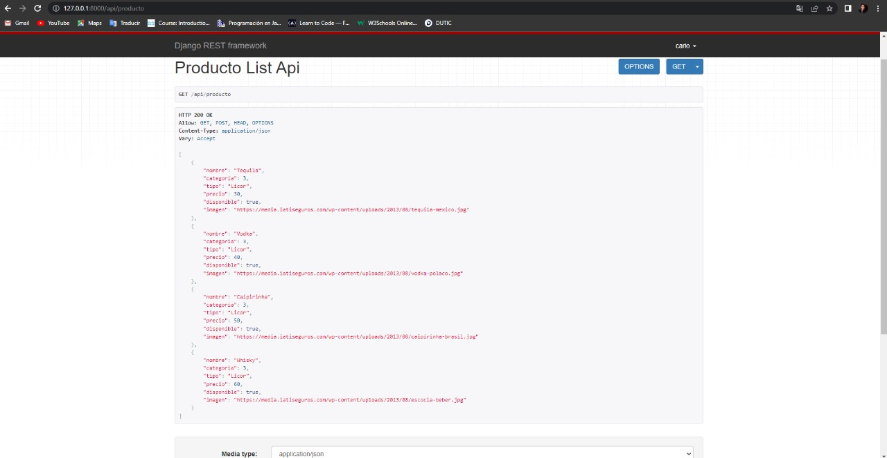
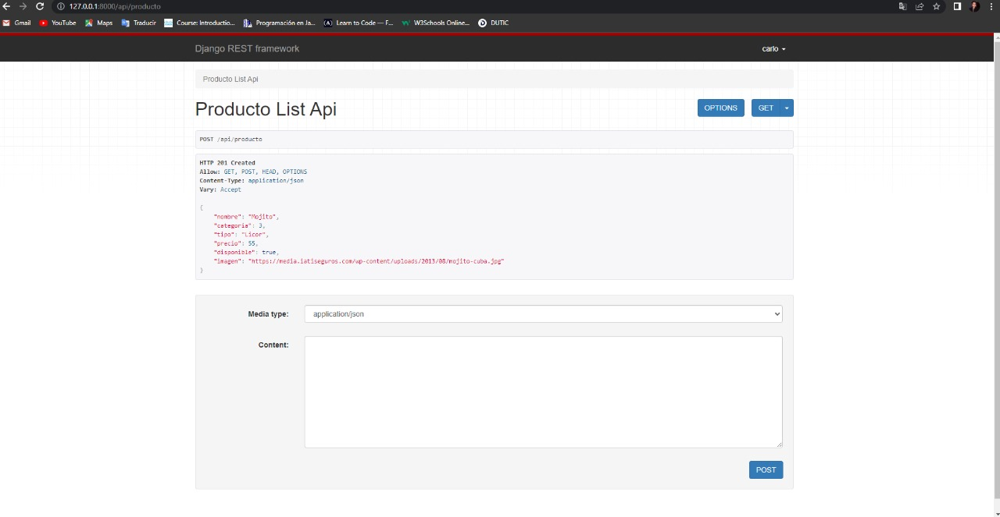
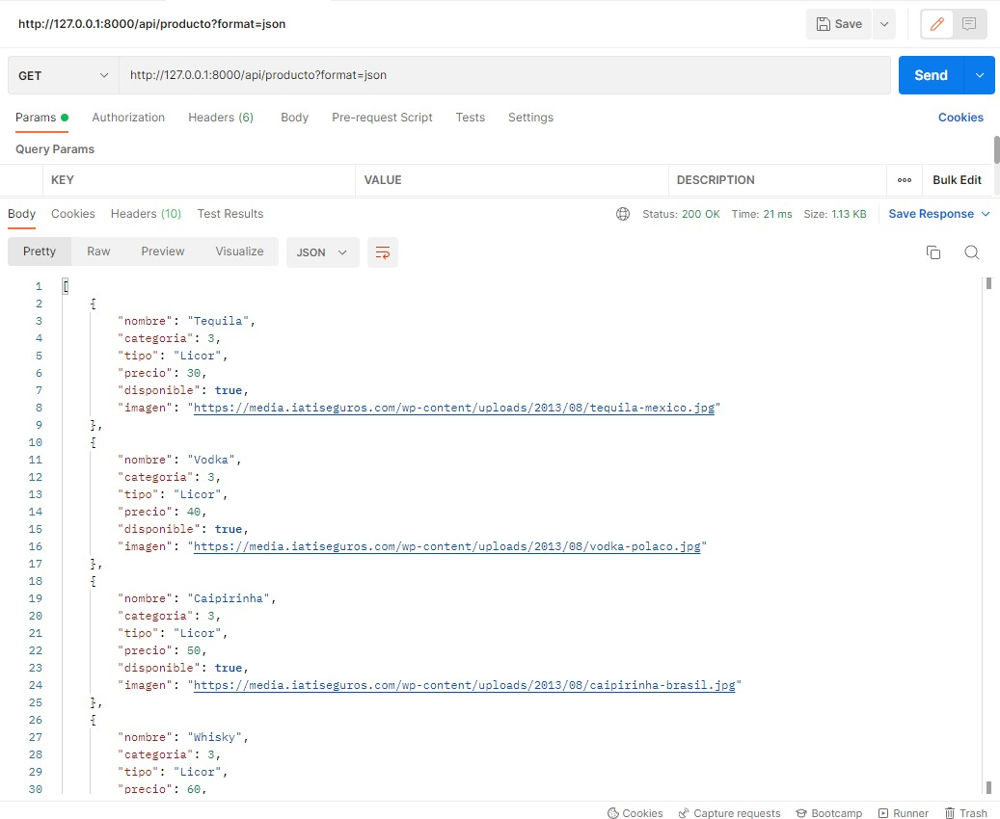
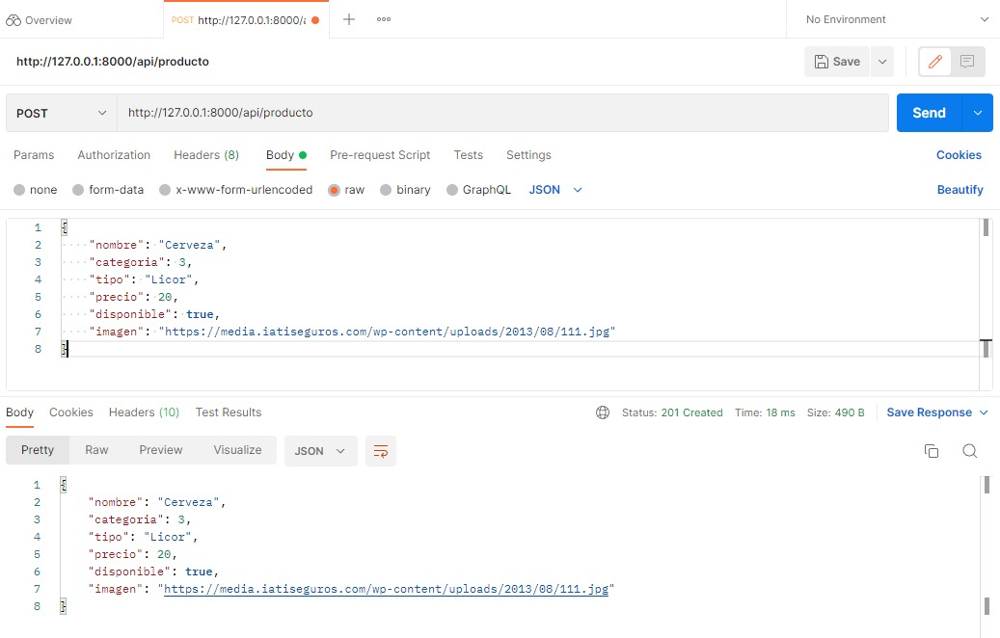
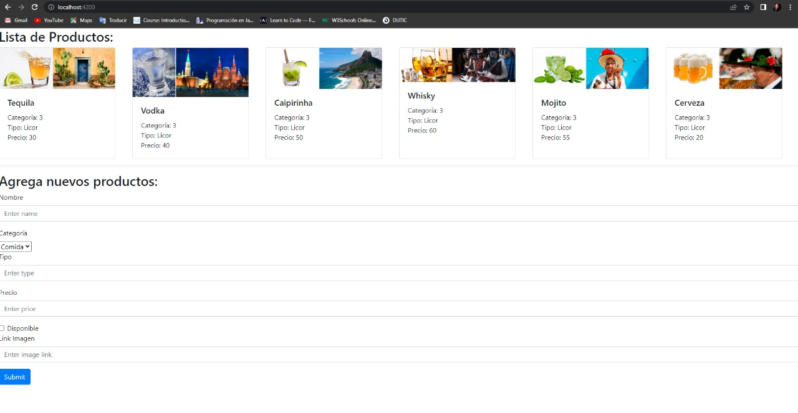
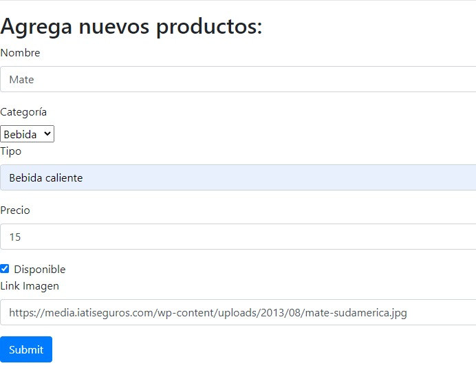
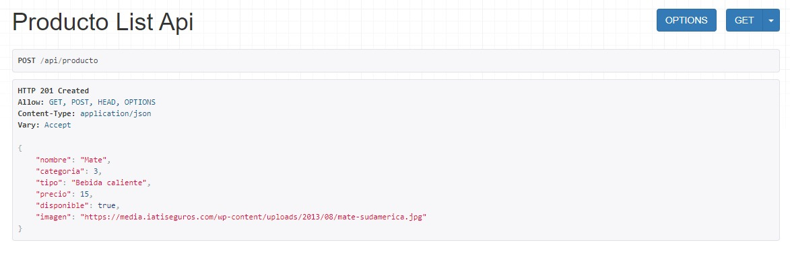
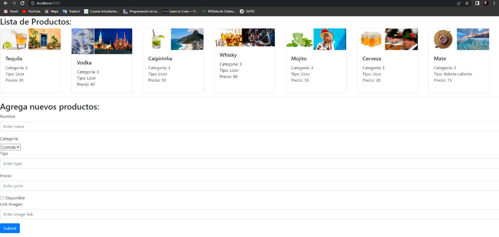

<div align="center">
<table>
    <theader>
        <tr>
            <td></td>
            <th>
                <span style="font-weight:bold;">UNIVERSIDAD NACIONAL DE SAN AGUSTIN</span><br />
                <span style="font-weight:bold;">FACULTAD DE INGENIERÍA DE PRODUCCIÓN Y SERVICIOS</span><br />
                <span style="font-weight:bold;">ESCUELA PROFESIONAL DE INGENIERÍA DE SISTEMAS</span>
            </th>
            <td></td>
        </tr>
    </theader>
    <tbody>
        <tr><td colspan="3"><span style="font-weight:bold;">Formato</span>: Guía de Práctica de Laboratorio / Talleres / Centros de Simulación</td></tr>
        <tr><td><span style="font-weight:bold;">Aprobación</span>:  2022/03/01</td><td><span style="font-weight:bold;">Código</span>: GUIA-PRLD-001</td><td><span style="font-weight:bold;">Página</span>: 1</td></tr>
    </tbody>
</table>
</div>

<div>
<span style="font-weight:bold;">INFORME DE LABORATORIO</span><br />

<table>
<theader>
<tr><th colspan="6">INFORMACIÓN BÁSICA</th></tr>
</theader>
<tbody>
<tr><td>ASIGNATURA:</td><td colspan="5">Programación Web 2</td></tr>
<tr><td>TÍTULO DE LA PRÁCTICA:</td><td colspan="5">API - Cliente Servidor</td></tr>
<tr>
<td>NÚMERO DE PRÁCTICA:</td><td>07</td><td>AÑO LECTIVO:</td><td>2022 A</td><td>NRO. SEMESTRE:</td><td>III</td>
</tr>
<tr>
<td>FECHA DE PRESENTACIÓN:</td><td>9/08/2022</td><td>HORA DE PRESENTACIÓN:</td><td colspan="3">12:00</td>
</tr>
<tr><td colspan="3">INTEGRANTE(s):
<ul>
<li>Moroccoire/Pacompia, Anthony Marcos - amoroccoire@unsa.edu.pe</li>
<li>Diaz/Portilla, Carlo Rodrigo - cdiazpor@unsa.edu.pe</li>
<li>Ticona/Hareth, Anthony Joaquín - aticonaha@unsa.edu.pe</li>
<li>Almonte/Cuba, Axel Frank - aalmontecu@unsa.edu.pe</li>
</ul>
</td>
<td>NOTA:</td><td colspan="2"></td>
</<tr>
<tr><td colspan="6">DOCENTE(s):
<ul>
<li>Richart Smith Escobedo Quispe - rescobedoq@unsa.edu.pe</li>
</ul>
</td>
</<tr>
</tbody>
</table>

<!-- Reportes -->
## SOLUCIÓN Y RESULTADOS

---

I. SOLUCIÓN DE EJERCICIOS/PROBLEMAS <br>
* Organización del repositorio:
    ```sh
	   └───Pw2-22_GrupoC02_Lab07
            ├───cliente
            │   └───...
            ├───img
            │   └───...
            ├───servidor
            │   └───...
            ├───.gitignore
            ├───pyvenv.cfg
            └───README.md
    ```
* **Modelo Producto:**  

  * Se crea el modelo del <code>Producto</code>, modelo del cual se va a crear una API que devuelva productos, el cual tiene los siguientes atributos:
  ```python
  nombre = models.TextField()
  categoria = models.IntegerField(choices=CATEGORIAS)
  tipo = models.TextField()
  precio = models.IntegerField()
  disponible = models.BooleanField()
  imagen = models.TextField()
  ```
* **Inserción de Productos**

  Se ejecuta el <code>shell</code> para poder ingresar elementos:

  ```sh
  ❯ python .\manage.py shell
  ```

  Se realiza la inserción inicial de 4 elementos de tipo <code>Producto</code>.
  ```sh
  >>> from producto.models import Producto 
  >>> Producto.objects.all()
  <QuerySet []>
  >>> Producto.objects.create(nombre="Tequila", categoria=3, tipo="Licor", precio=30, disponible=True, imagen="https://media.iatiseguros.com/wp-content/uploads/2013/08/tequila-mexico.jpg")
  <Producto: Producto object (1)>
  >>> Producto.objects.create(nombre="Vodka", categoria=3, tipo="Licor", precio=40, disponible=True, imagen="https://media.iatiseguros.com/wp-content/uploads/2013/08/vodka-polaco.jpg")     
  <Producto: Producto object (2)>
  >>> Producto.objects.create(nombre="Caipirinha", categoria=3, tipo="Licor", precio=50, disponible=True, imagen="https://media.iatiseguros.com/wp-content/uploads/2013/08/caipirinha-brasil.jpg")
  <Producto: Producto object (3)>
  >>> Producto.objects.create(nombre="Whisky", categoria=3, tipo="Licor", precio=60, disponible=True, imagen="https://media.iatiseguros.com/wp-content/uploads/2013/08/escocia-beber.jpg")         
  <Producto: Producto object (4)>
  ```

* **Creación de la API**

  Se instala el <code>django_rest_framework</code> con el siguiente comando:

  ```sh
  ❯ pip install django_rest_framework
  ```

  Se agrega el <code>django_rest_framework</code> en las aplicaciones instaladas.

  ```sh
  INSTALLED_APPS = [
    'rest_framework',
  ]
  ```

  Se inicia la app <code>api</code> la cual va a contener la API de los productos. De la siguiente manera:

  ```sh
  ❯ python .\manage.py startapp api
  ```

  Se crean los archivos <code>api/serializers.py</code> y <code>api/urls.py</code> dentro de la app <code>api</code>.

  Se agrega los <code>path</code>de la API en el archivo <code>restaurante/urls.py</code>.

  ```python
  urlpatterns = [
    path('api-auth/', include('rest_framework.urls')),
    path('api/', include(api_urls)),
  ]
  ```

  Para crear la API se edita el archivo <code>api/serializers.py</code> debido a que para convertirlo en una API Django REST framework necesita que serializemos el modelo, donde se especifica el modelo y sus campos de la siguiente manera:

  ```python
  class ProductoSerializer(serializers.ModelSerializer):
    class Meta:
        model = Producto
        fields = ["nombre", "categoria", "tipo", "precio", "disponible", "imagen"]
  ```

  Ahora se crean las vistas donde se va a definir el metodo <code>GET</code> y <code>POST</code>, donde se consultarán  y agregarán los productos de la base de datos respectivamente.

  ```python
  class ProductoListApiView(APIView):

    def get(self, request, *args, **kwargs):
        ...

    def post(self, request, *args, **kwargs):
        ...
  ```

  Se configura el archivo <code>api/urls.py</code> para obtener las vistas.

  ```python
  urlpatterns = [
    path('producto', ProductoListApiView.as_view()),
  ]
  ```
* **Modelo Producto mediante GET, POST**

  * Resultado en Navegador Web:

    * Método GET:

  

    * Método POST:

  

  * Resultado en Cliente REST(Postman):

    * Método GET:
  
  

    * Método POST:

  

* **Creación de cliente REST que consume servicio(ANGULAR)**

  Se genera el servicio <code>api</code> ejecutando el siguiente comando:

  ```sh
    ❯ ng generate service api
    CREATE src/app/api.service.spec.ts (342 bytes)
    CREATE src/app/api.service.ts (132 bytes)
  ```

  Para consumir el servicio API - GET de los productos que se insertaron previamente, se realizará una lista con los contenidos de los productos.

  Se modifica el archivo <code>app.component.html</code> donde se va a listar los contenidos y donde se encuentra el formulario para agregar nuevos productos.

  

  Ahora se observan los productos que fueron ingresados anteriormente por el <code>shell</code>, además se encuentra un formulario para agregar más productos.

  Posteriormente se desea agregar un nuevo producto, entonces se llenan los campos con los atributos del productos y cuando se pulsa en <code>submit</code> se genera un <code>POST</code> el cual envía los datos ingresados en el form.

  

  Aquí se ve que el producto fue agregado exitosamente a través de un <code>POST</code>, donde se puede ver en formato <code>json</code> los contenidos.

  

  Y en la lista de los productos ahora se ha integrado el nuevo producto que fue ingresado en el formulario.

  
---
    
## RETROALIMENTACIÓN GENERAL

  <pre>
                                                                          
                                                                           
  </pre>

---
    
### REFERENCIAS Y BIBLIOGRAFÍA
<ul>
    <li>https://www.w3schools.com/python/python_reference.asp</li>
    <li>https://docs.python.org/3/tutorial/</li>
</ul>
